<h1 align="center">GlamCart - iOS App</h1>

<p align="center">
  
  
  
  
  
  
</p>

**GlamCart** is a clean and functional iOS shopping app built with **SwiftUI**. It demonstrates a complete e-commerce flow (browse, search, favorites, cart, checkout) using **MVVM** and a lightweight Swift Package (`DummyAPI`) that consumes the **DummyJSON** API.

---

## ✨ Features:

- **Authentication**: Login plus local sign-up persisted with `UserDefaults`.
- **Browse Products**: Grid-based catalog with pagination / infinite scrolling.
- **Search & Filters**: Search by product name and apply sorting/filter options.
- **Product Details**: Detailed product view with images, rating, and pricing.
- **Favorites**: Save products for quick access.
- **Cart & Checkout**: Quantity stepper, totals, and a complete-order flow.
- **Profile**: User details, address, card info, and sign-out.

---

## 📦 Requirements:

- iOS 16.0+
- Xcode 14+
- Swift 5.0+

---

## ⛓ Project Structure:

    GlamCartShoppingApp-SwiftUI
    .
    ├── DummyAPI                 # Swift Package (DummyJSON API wrapper)
    ├── Shopping                 # Main iOS app target
    │   ├── App                  # App entry + global UI appearance
    │   ├── Core                 # Feature modules (Home, Auth, Cart, etc.)
    │   ├── CustomViews          # Reusable UI components
    │   ├── Helpers              # Colors, view modifiers, utilities
    │   ├── Managers             # Storage / managers
    │   └── Resources            # Assets, previews
    ├── ShoppingTests
    └── ShoppingUITests

---

## 🛠️ Installation:

1. Clone the repository:
   ```bash
   git clone https://github.com/deepanshubajaj/GlamCartShoppingApp-SwiftUI.git
   ```

2. Open in Xcode:
   ```bash
   open Shopping.xcodeproj
   ```

3. Build and run on a simulator or device.

---

## 🌐 APIs:

- [DummyJSON](https://dummyjson.com)

<p align="center">
  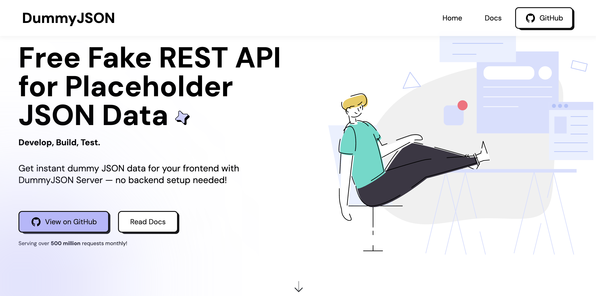
</p>

---

## 🛠 Technologies Used:

- **SwiftUI** — UI development
- **MVVM** — separation of concerns
- **Swift Package Manager** — local `DummyAPI` package
- **UserDefaults** — token + signup persistence

---

## 🎨 App Look:

<p align="center">
  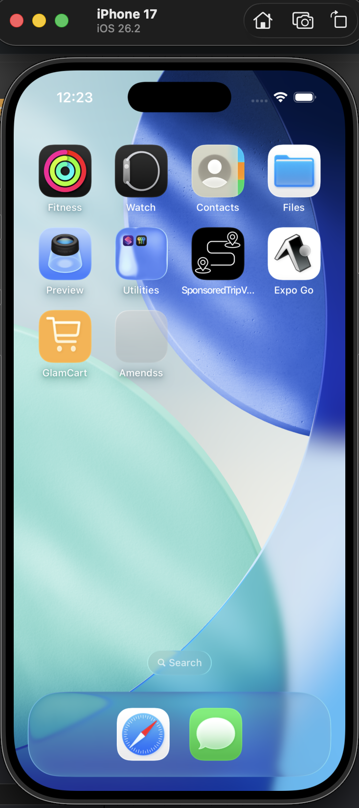
</p>
<p align="center">
  *App snapshot in the simulator.*
</p>

---

## 🖼️ Screenshots:

<p align="center">
  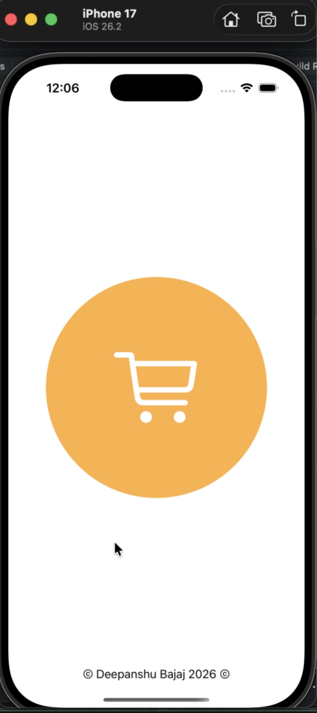
</p>

<p align="center">
  *Splash screen displayed upon app launch.*
</p>

##

<p align="center">
    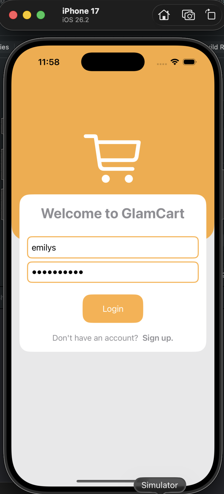
    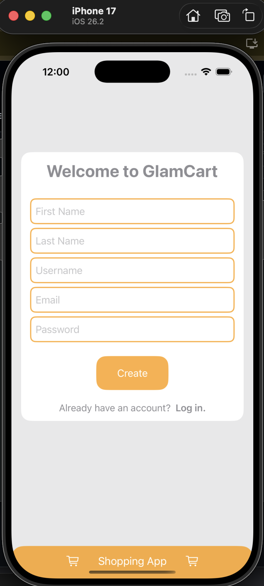
    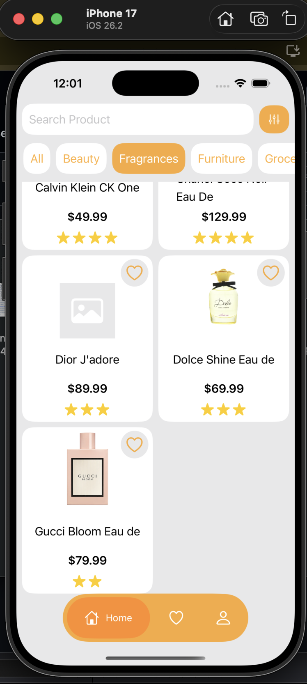
</p>

##

<p align="center">
    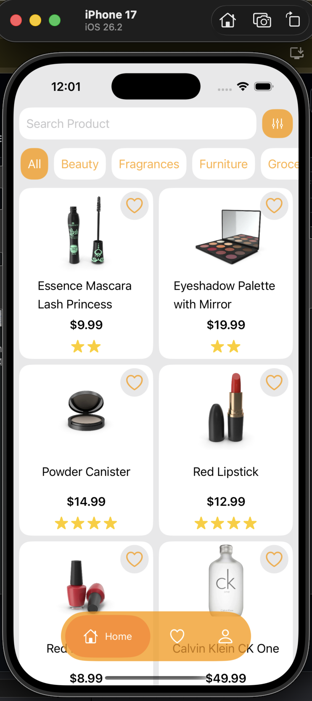
    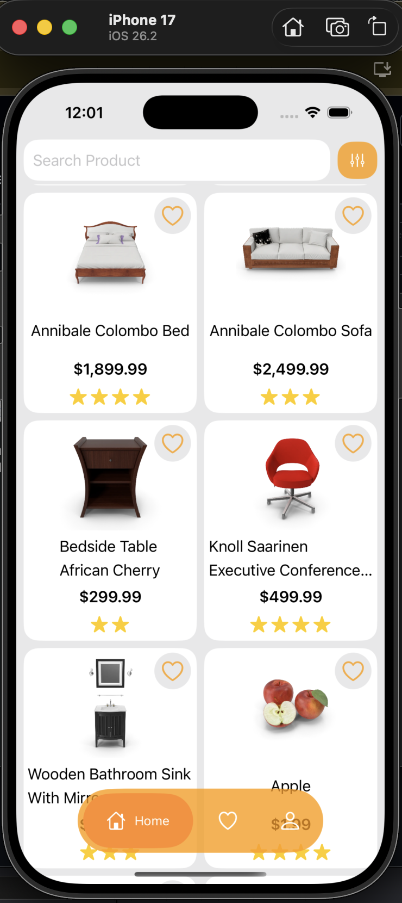
    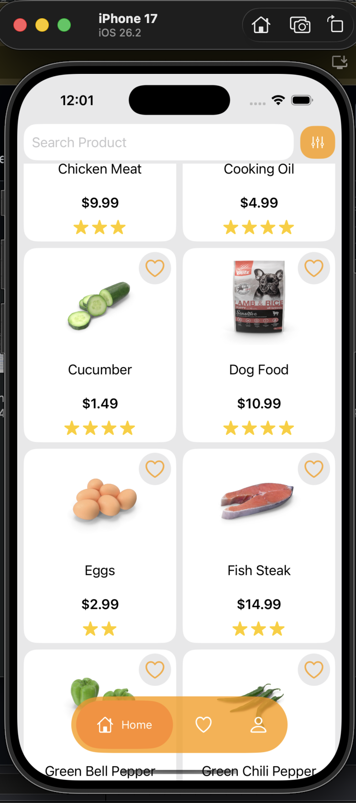
</p>

##

<p align="center">
    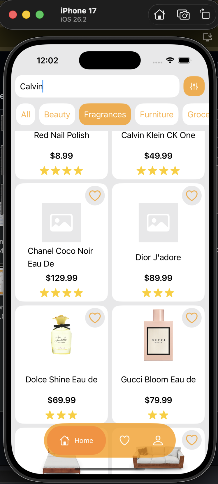
    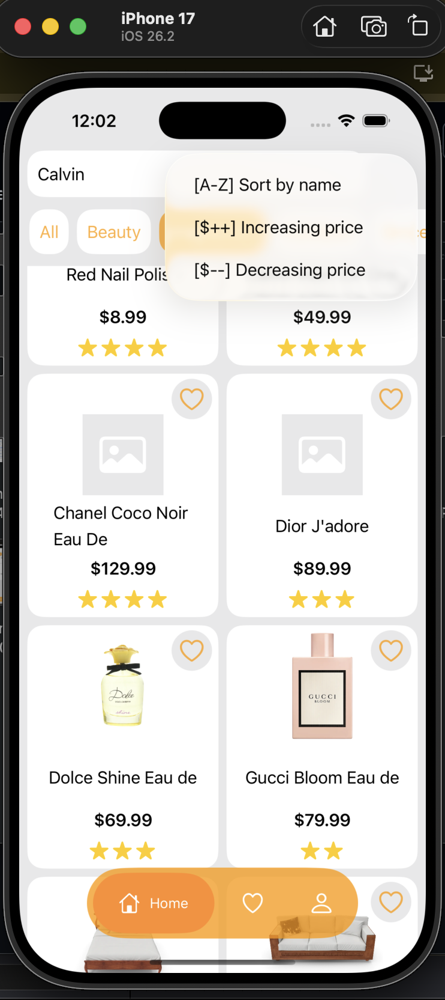
    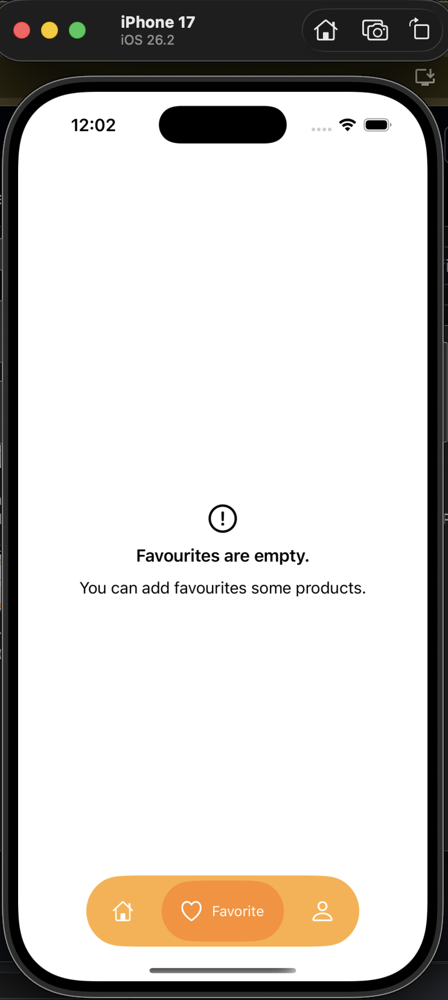
</p>

##

<p align="center">
    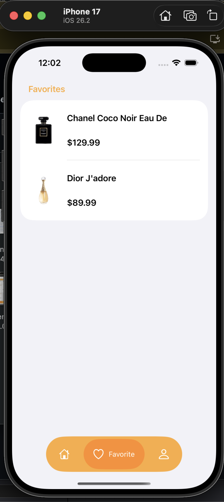
    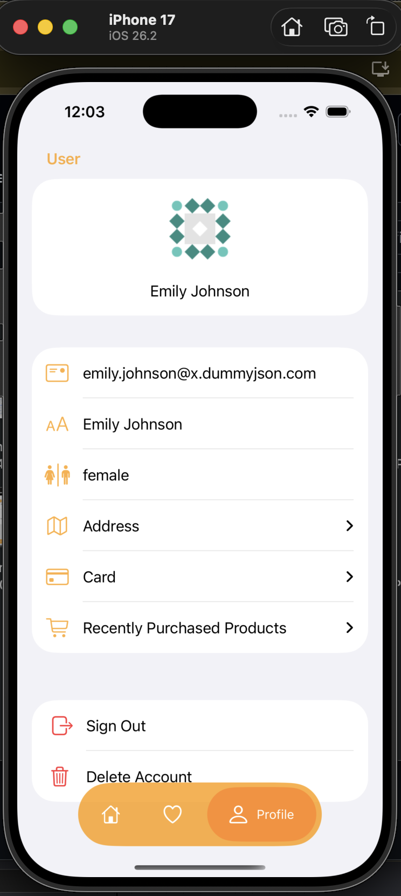
    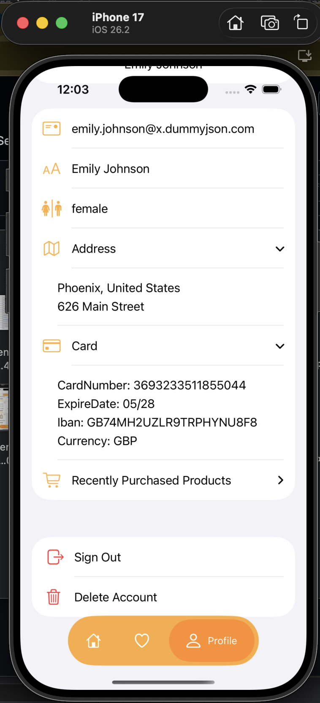
</p>

##

<p align="center">
    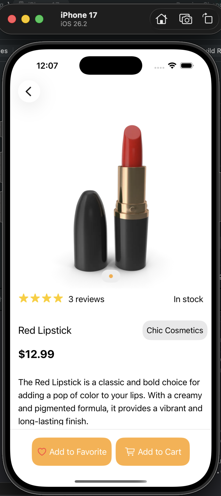
    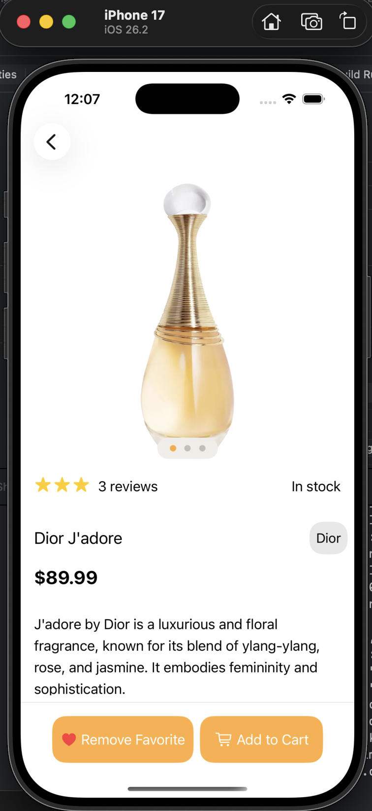
    
</p>


<p align="center">
  *Screenshots of the GlamCart App showing different screens*
</p>

---

## 📱 App Icon:

<p align="center">
  
</p>
<p align="center">
  *The App Icon reflects the GlamCart Look*
</p>

---

## 🚀 Video Demo:

Here’s a short video showcasing the app's functionality:

<p align="center">
  
</p>

➤ <a href="ProjectOutputs/WorkingVideo/WorkingVideoD.MP4">🎥 Watch Working Video</a>

---

## 🤝 Contributing:

Thank you for your interest in contributing to this project!  
I welcome contributions from the community.

- You are free to use, modify, and redistribute this code under the terms of the **Apache-2.0 License**.
- If you'd like to contribute, please **open an issue** or **submit a pull request**.
- All contributions will be reviewed and approved by the author — **[Deepanshu Bajaj](https://github.com/deepanshubajaj?tab=overview&from=2025-03-01&to=2025-03-31)**.

---

### 📌 How to Contribute:

To contribute:

1. Fork the repository.

2. Create a new branch:
   ```bash
    git checkout -b feature/your-feature-name
   ```

3. Commit your changes:
   ```bash
    git commit -m 'Add your feature'
   ```

4. Push to the branch:
   ```bash
    git push origin feature/your-feature-name
   ```

5. Open a pull request.

---

## 📃 License:

This project is licensed under the [Apache-2.0 License](./LICENSE).  
You are free to use this project for personal, educational, or commercial purposes — just make sure to provide proper attribution.

> **Clarification:** Commercial use includes, but is not limited to, use in products,  
> services, or activities intended to generate revenue, directly or indirectly.

